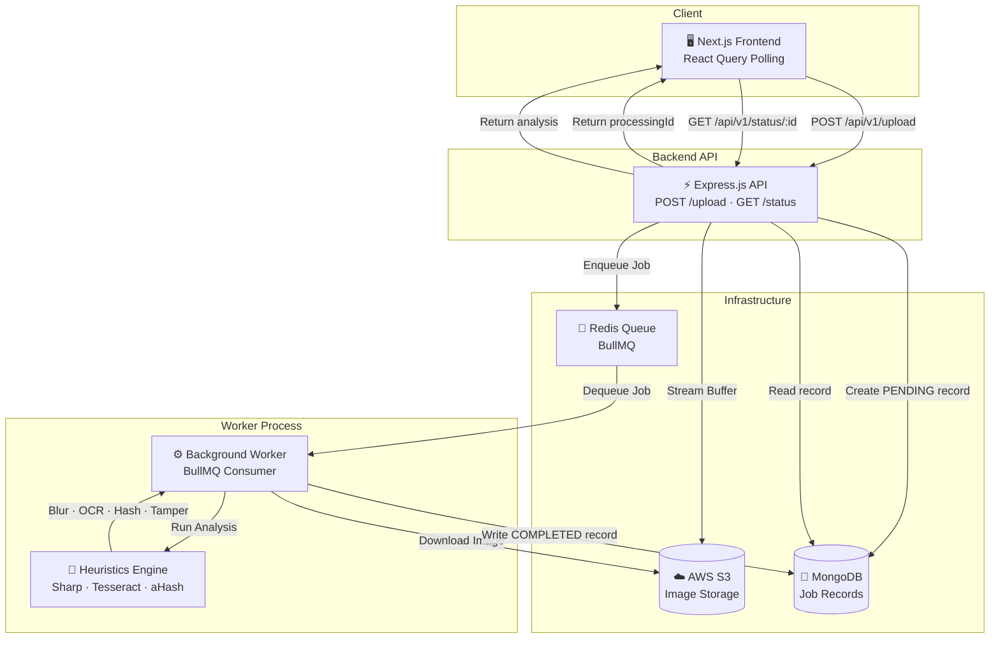

<div align="center">

<br/>


<br/><br/>

# Ginger Media
## Intelligent Vehicle Image Processing Pipeline

> **A production-grade, cloud-native AI pipeline that validates, analyzes, and quality-assures vehicle imagery at scale — fully asynchronous, blazing fast, and built to handle real-world chaos.**

<br/>

[](https://www.typescriptlang.org/)
[](https://nextjs.org/)
[](https://nodejs.org/)
[](https://mongodb.com/)
[](https://redis.io/)
[](https://aws.amazon.com/s3/)
[](https://tailwindcss.com/)
[](https://www.docker.com/)

<br/>

</div>

---

## 📖 Table of Contents

- [Overview](#-overview)
- [Why Ginger Media?](#-why-ginger-media)
- [Key Features](#-key-features)
- [System Architecture](#-system-architecture)
- [Technology Stack](#-technology-stack)
- [Project Structure](#-project-structure)
- [Setup & Installation](#-setup--installation)
- [Environment Variables](#-environment-variables)
- [API Reference](#-api-reference)
- [Processing Pipeline Deep Dive](#-processing-pipeline-deep-dive)
- [Roadmap](#-roadmap)

---

## 🚀 Overview

**Ginger Media** is an enterprise-grade, asynchronous AI pipeline engineered to automate the complete quality assurance lifecycle of vehicle images. Whether you're running a used-car marketplace, an insurance platform, or a fleet management system — image quality is everything.

The system accepts raw image uploads, immediately returns a processing ID to the client (zero blocking), and dispatches the heavy lifting to background workers. These workers run a multi-stage heuristics engine that checks for blur, validates license plates via OCR, detects duplicate uploads using perceptual hashing, and flags screenshots or tampered images — all in parallel.

The result is a **sub-second upload experience** paired with a **comprehensive AI analysis report** delivered asynchronously.

---

## 💡 Why Ginger Media?

Manual image review doesn't scale. Here's what this pipeline solves:

| Problem | Solution |
|---|---|
| Blurry or low-quality images slip through | Laplacian variance convolution scores every image mathematically |
| Duplicate uploads waste storage & confuse buyers | 64-bit perceptual hashing (aHash) catches duplicates regardless of filename or compression |
| Fake/screenshot images damage platform trust | EXIF analysis + aspect ratio heuristics flag non-original images |
| License plate data is unstructured | Tesseract OCR extracts and validates alphanumeric plate strings |
| Heavy processing blocks the user | BullMQ + Redis offloads all analysis to async background workers |
| Ephemeral server storage is unreliable | All images are streamed directly to AWS S3 on upload |

---

## ✨ Key Features

### 🔄 Fully Asynchronous Processing
Upload returns instantly. A `processingId` is handed back to the client while BullMQ dispatches the job to a Redis-backed worker queue. The frontend polls for status updates using React Query — no user ever waits on a spinner for AI analysis.

### 🧠 Multi-Stage Heuristics Engine
Every image passes through a sequential analysis pipeline:

- **Laplacian Blur Detection** — Applies a Laplacian convolution kernel via Sharp (libvips) to compute the variance of edge gradients. A low variance score indicates a blurry, out-of-focus image that fails quality thresholds.
- **Brightness Analysis** — Computes the mean luminance of the image to catch overexposed or underexposed uploads.
- **Tesseract OCR (Plate Extraction)** — Tesseract.js is configured with a custom character whitelist (`A-Z0-9`) and PSM mode tuned for single-line text, specifically targeting vehicle registration plates.
- **Perceptual Hashing (aHash)** — Generates a 64-bit fingerprint of the image's visual content. Identical or near-identical images produce the same hash, enabling duplicate detection even after re-compression or minor edits.
- **Tamper & Screenshot Detection** — Inspects EXIF metadata for missing camera signatures and checks aspect ratios against known screenshot dimensions to flag non-original images.

### 🖥️ Premium Dark Mode Dashboard
Built with Next.js 15 App Router, Shadcn UI, and Framer Motion. Features a drag-and-drop upload zone, real-time status cards, animated result panels, and a fully responsive layout — desktop and mobile.

### ☁️ Cloud-Native by Design
Images are streamed directly to AWS S3 on upload — no disk I/O on the server. Workers pull from S3 for analysis. The system is stateless and horizontally scalable.

### 🗄️ Flexible Persistence
MongoDB with Prisma ORM stores all job records and analysis results. The document model is flexible enough to evolve the analysis schema without migrations.

---

## 🏗 System Architecture

The monorepo contains two fully decoupled services: a **Next.js frontend** and an **Express.js backend** with a dedicated **BullMQ worker process**.



### Data Flow Summary

1. **Upload** — Client POSTs image → API streams to S3, creates a `PENDING` MongoDB record, enqueues a BullMQ job, returns `processingId` immediately.
2. **Processing** — Worker dequeues job, downloads image from S3, runs the 5-stage heuristics engine, writes `COMPLETED` record with full analysis to MongoDB.
3. **Polling** — Frontend polls `GET /status/:id` every 2 seconds via React Query until status is `COMPLETED`, then renders the analysis report.

---

## 💻 Technology Stack

### Frontend
| Technology | Purpose |
|---|---|
| Next.js 15 (App Router) | React framework with server components |
| React 19 | UI rendering |
| Tailwind CSS | Utility-first styling |
| Shadcn UI | Accessible, composable component library |
| Framer Motion | Fluid animations and transitions |
| React Query (TanStack) | Server state management & polling |
| Axios | HTTP client |
| React Dropzone | Drag-and-drop file upload UX |

### Backend
| Technology | Purpose |
|---|---|
| Node.js + TypeScript | Runtime & type safety |
| Express.js | HTTP API framework (Clean Architecture) |
| BullMQ | Distributed job queue |
| Redis | Queue broker & job state |
| MongoDB | Document database for job records |
| Prisma ORM | Type-safe database client |
| Sharp (libvips) | High-performance image processing |
| Tesseract.js | OCR engine for plate extraction |
| AWS SDK v3 (S3) | Cloud object storage |
| Pino | Structured JSON logging |
| Multer | Multipart form data parsing |

---

## 📁 Project Structure

```
ginger-media/
├── frontend/                   # Next.js 15 App
│   ├── app/
│   │   ├── page.tsx            # Upload dashboard
│   │   └── layout.tsx
│   ├── components/
│   │   ├── UploadZone.tsx      # Drag-and-drop uploader
│   │   ├── StatusCard.tsx      # Real-time result display
│   │   └── AnalysisReport.tsx  # Full analysis breakdown
│   └── lib/
│       └── api.ts              # Axios API client
│
├── backend/                    # Express.js API + Worker
│   ├── src/
│   │   ├── api/
│   │   │   ├── routes/         # Express route handlers
│   │   │   └── middleware/     # Error handling, validation
│   │   ├── services/
│   │   │   ├── s3.service.ts   # AWS S3 upload/download
│   │   │   ├── blur.service.ts # Laplacian blur detection
│   │   │   ├── ocr.service.ts  # Tesseract plate extraction
│   │   │   ├── hash.service.ts # Perceptual hashing (aHash)
│   │   │   └── tamper.service.ts # EXIF + screenshot detection
│   │   ├── worker/
│   │   │   └── processor.ts    # BullMQ job processor
│   │   └── prisma/
│   │       └── client.ts       # Prisma MongoDB client
│   └── prisma/
│       └── schema.prisma       # Data model
│
├── docker-compose.yml          # Local Redis + MongoDB
└── README.md
```

---

## 🛠 Setup & Installation

### Prerequisites

| Requirement | Version | Notes |
|---|---|---|
| Node.js | 18+ | LTS recommended |
| MongoDB | Any | Atlas free tier works |
| Redis | 6+ | Upstash free tier or local Docker |
| AWS Account | — | S3 bucket + IAM credentials |

### Option A — Docker (Recommended for Local Dev)

Spin up Redis and MongoDB instantly:

```bash
docker-compose up -d
```

### Option B — Manual Setup

#### 1. Clone & Install

```bash
git clone https://github.com/your-org/ginger-media.git
cd ginger-media
```

#### 2. Backend Setup

```bash
cd backend
npm install
cp .env.example .env
```

Configure your `.env` (see [Environment Variables](#-environment-variables) below), then:

```bash
npx prisma db push      # Push schema to MongoDB
npx prisma generate     # Generate Prisma client
npm run dev             # Start API on :3000
```

In a separate terminal, start the worker process:

```bash
npm run worker          # Start BullMQ worker
```

#### 3. Frontend Setup

```bash
cd frontend
npm install
npm run dev             # Start Next.js on :3001
```

Open [http://localhost:3001](http://localhost:3001) — the dashboard is live.

---

## 🔐 Environment Variables

### Backend `.env`

```env
# ── Database ──────────────────────────────────────────────
DATABASE_URL="mongodb+srv://<user>:<password>@<cluster>.mongodb.net/ginger_media"

# ── Redis (BullMQ Queue) ───────────────────────────────────
REDIS_HOST="your-redis-host.upstash.io"
REDIS_PORT=6379
REDIS_PASSWORD="your-secure-redis-password"

# ── AWS S3 Storage ─────────────────────────────────────────
AWS_ACCESS_KEY_ID="your-aws-access-key-id"
AWS_SECRET_ACCESS_KEY="your-aws-secret-access-key"
AWS_REGION="us-east-1"
AWS_BUCKET_NAME="your-s3-bucket-name"

# ── Server ─────────────────────────────────────────────────
PORT=3000
FRONTEND_URL="http://localhost:3001"
```

> **Security Note**: Never commit `.env` to version control. The `.gitignore` already excludes it. Use AWS IAM roles with least-privilege S3 permissions in production.

---

## 📡 API Reference

### `POST /api/v1/upload`

Accepts a vehicle image, streams it to S3, creates a processing record, and enqueues an analysis job. Returns immediately — does not wait for analysis to complete.

**Request**
```
Content-Type: multipart/form-data
Body: image (File) — jpeg | png | webp, max 10MB
```

**Response `202 Accepted`**
```json
{
  "processingId": "64f1b2c3d4e5f6a7b8c9d0e1",
  "message": "Image queued for processing successfully.",
  "estimatedProcessingTime": "3-8 seconds"
}
```

---

### `GET /api/v1/status/:id`

Polls the processing status for a given `processingId`. Returns the full analysis report once the worker completes.

**Response — Processing**
```json
{
  "id": "64f1b2c3d4e5f6a7b8c9d0e1",
  "status": "PROCESSING",
  "analysis": null
}
```

**Response — Completed**
```json
{
  "id": "64f1b2c3d4e5f6a7b8c9d0e1",
  "status": "COMPLETED",
  "analysis": {
    "blurScore": 1420.5,
    "brightnessScore": 165,
    "isBlurry": false,
    "isPlateValid": true,
    "plateNumber": "MH12AB1234",
    "isDuplicate": false,
    "perceptualHash": "f3c4a2b1d0e9f8a7",
    "isScreenshot": false,
    "isTampered": false,
    "dimensions": {
      "width": 1920,
      "height": 1080
    },
    "processingTimeMs": 4231
  }
}
```

**Response — Failed**
```json
{
  "id": "64f1b2c3d4e5f6a7b8c9d0e1",
  "status": "FAILED",
  "error": "Image could not be decoded. Unsupported format."
}
```

---

## 🔬 Processing Pipeline Deep Dive

Each job runs through 5 sequential analysis stages inside the worker:

```
Image Buffer (from S3)
        │
        ▼
┌───────────────────┐
│  1. Blur Detection │  Laplacian variance → blurScore + isBlurry flag
└────────┬──────────┘
         │
         ▼
┌────────────────────────┐
│  2. Brightness Analysis │  Mean luminance → brightnessScore (0–255)
└────────┬───────────────┘
         │
         ▼
┌──────────────────────┐
│  3. OCR Plate Extract │  Tesseract PSM-7, whitelist A-Z0-9 → plateNumber
└────────┬─────────────┘
         │
         ▼
┌──────────────────────────┐
│  4. Perceptual Hash (aHash)│  64-bit fingerprint → isDuplicate check
└────────┬─────────────────┘
         │
         ▼
┌──────────────────────────────┐
│  5. Tamper & Screenshot Check │  EXIF + aspect ratio → isTampered, isScreenshot
└────────┬─────────────────────┘
         │
         ▼
  Write COMPLETED record → MongoDB
```

### Blur Detection Thresholds

| blurScore | Classification |
|---|---|
| `< 100` | ❌ Very Blurry — Rejected |
| `100 – 500` | ⚠️ Slightly Blurry — Warning |
| `> 500` | ✅ Sharp — Accepted |

---

## 🔮 Roadmap

### Near-Term
- [ ] **WebSockets** — Replace HTTP polling with Socket.io for instant push-based status updates
- [ ] **Batch Upload** — Accept ZIP archives and process multiple images in a single job
- [ ] **Webhook Support** — POST analysis results to a caller-defined callback URL on completion

### Mid-Term
- [ ] **Deep Learning Models** — Integrate ONNX Runtime for vehicle damage detection and make/model classification
- [ ] **Admin Dashboard** — Queue depth monitoring, worker health, and job retry controls
- [ ] **Rate Limiting** — Per-IP upload throttling with Redis-backed sliding window counters

### Long-Term
- [ ] **Worker Autoscaling** — Kubernetes KEDA to scale BullMQ workers based on queue depth
- [ ] **Multi-Region Replication** — S3 cross-region replication for global low-latency access
- [ ] **Audit Logging** — Immutable processing history with tamper-evident logs

---

<div align="center">

<br/>

**Ginger Media** — Built for scale. Engineered for precision.

<br/>

*If this project helped you, consider giving it a ⭐ on GitHub.*

<br/>

</div>
