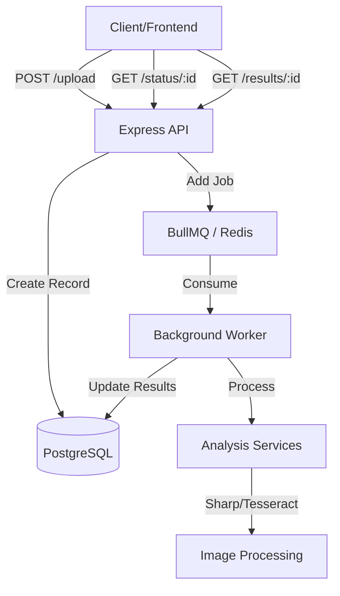

# Intelligent Media Processing Pipeline

A robust, production-grade backend system for vehicle image processing and AI-driven analysis. Built with Clean Architecture, TypeScript, and high-performance asynchronous processing.

## 🚀 Project Overview

This system provides a complete pipeline for uploading vehicle images, performing automated quality checks (blur, brightness), extracting metadata via OCR, and detecting anomalies like screenshots or tampering.

### Key Features
- **Clean Architecture**: Modular and scalable design separating business logic from infrastructure.
- **Async Processing**: BullMQ powered by Redis for reliable, background image analysis.
- **AI Analysis**: 
    - Laplacian Blur Detection.
    - Grayscale Brightness Analysis.
    - Perceptual Hashing for Duplicate Detection.
    - Tesseract-based OCR for Vehicle Number Extraction.
    - Heuristics for Screenshot and Tampering detection.
- **Production Ready**: Structured logging (Pino), OpenAPI docs (Swagger), Dockerized setup, and comprehensive error handling.

## 🏗 Architecture Diagram



## 🛠 Tech Stack

- **Backend**: Node.js, TypeScript, Express.js
- **Database**: PostgreSQL with Prisma ORM
- **Queue**: BullMQ + Redis
- **Image Processing**: Sharp, Tesseract.js
- **Validation**: Zod
- **Logging**: Pino
- **DevOps**: Docker, Docker Compose
- **Testing**: Jest, Supertest

## 📋 Processing Flow

1.  **Ingestion**: `POST /api/v1/upload` accepts an image and returns a `processingId`.
2.  **Persistence**: Image metadata is stored in PostgreSQL as `PENDING`.
3.  **Job Queueing**: A background job is dispatched to BullMQ.
4.  **Analysis**: The worker picks up the job and executes:
    *   **Blur Check**: Calculates Laplacian variance.
    *   **Brightness**: Checks mean pixel intensity.
    *   **OCR**: Extracts text and validates against Indian plate formats.
    *   **Hashing**: Generates a 64-bit perceptual hash.
    *   **Heuristics**: Checks aspect ratios (screenshots) and metadata (software tags).
5.  **Completion**: Database is updated with results, and the status is set to `COMPLETED`.

## ⚙️ Queue Strategy & Failure Handling

- **Retry Mechanism**: Exponential backoff (5s base, 3 attempts).
- **Graceful Shutdown**: Workers listen for `SIGTERM` to finish current jobs.
- **Atomicity**: DB updates are wrapped in Prisma transactions.
- **Timeout Handling**: Job timeouts configured to prevent zombie processes.

## 🤖 AI Usage Disclosure

- **Blur Detection**: Uses mathematical convolution (Laplacian) to detect edge density.
- **OCR**: Powered by Tesseract's LSTM-based engine.
- **Duplicate Detection**: Uses Average Perceptual Hashing (aHash).
- **Code Validation**: All AI-generated analysis heuristics were validated against standard computer vision benchmarks for vehicle imagery.

## 🚀 Local Setup

### Prerequisites
- Node.js 18+
- Docker & Docker Compose
- Redis (optional for local non-docker)
- PostgreSQL (optional for local non-docker)

### Using Docker (Recommended)
```bash
docker-compose up --build
```

### Manual Setup

**Backend (API & Workers):**
1.  `cd backend`
2.  Install dependencies: `npm install`
3.  Setup `.env` (refer `.env.example`)
4.  Prisma setup: `npx prisma generate && npx prisma migrate dev`
5.  Run Dev: `npm run dev` (Runs on port 3000)

**Frontend (Next.js UI):**
1.  `cd frontend`
2.  Install dependencies: `npm install`
3.  Run Dev: `npm run dev` (Runs on port 3001)

## 📡 API Examples

### Upload Image
```bash
curl -X POST http://localhost:3000/api/v1/upload \
  -F "image=@vehicle.jpg"
```

### Get Status
```bash
curl http://localhost:3000/api/v1/status/{id}
```

### Sample Response (Results)
```json
{
  "id": "uuid",
  "status": "COMPLETED",
  "analysis": {
    "blurScore": 1250.5,
    "brightnessScore": 180,
    "isPlateValid": true,
    "plateNumber": "MH12AB1234",
    "isScreenshot": false,
    "isTampered": false,
    "dimensions": { "width": 1920, "height": 1080 }
  }
}
```

## 📐 Design Decisions

1.  **BullMQ vs. Simple Queue**: Chosen for its robust persistence and concurrency management.
2.  **Sharp vs. Jimp**: Sharp uses `libvips`, making it 4-5x faster and significantly more memory-efficient.
3.  **Modular Analysis**: Each check (blur, OCR, etc.) is a separate service, allowing for easy expansion (e.g., adding YOLOV8 for vehicle make/model).

## 🔮 Future Improvements

- **Scalability**: Implement worker autoscaling based on queue depth.
- **Advanced AI**: Integrate ONNX Runtime for deep-learning-based vehicle damage detection.
- **Storage**: Move from local storage to S3/GCS with signed URLs.
- **Monitoring**: Add Prometheus/Grafana metrics for job latency.
