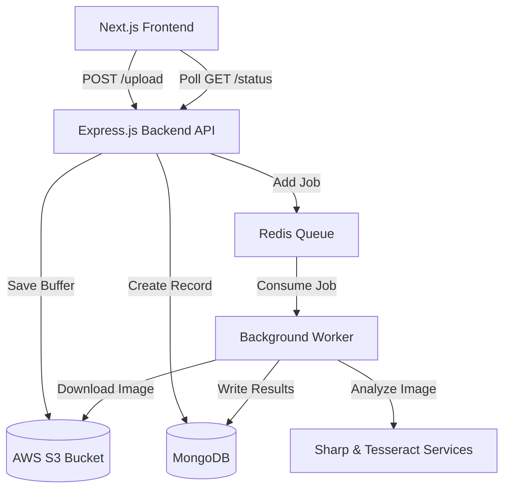

<div align="center">
  
# 🧠 Intelligent Media Processing Pipeline
  
**A production-grade, asynchronous AI pipeline for validating and analyzing vehicle imagery at scale.**

[](https://www.typescriptlang.org/)
[](https://nextjs.org/)
[](https://nodejs.org/)
[](https://mongodb.com/)
[](https://redis.io/)
[](https://tailwindcss.com/)

</div>

---

## 🚀 Overview

The **Intelligent Media Processing Pipeline** is a cloud-native, highly scalable monorepo application engineered to automate the quality assurance of uploaded vehicle images. By leveraging advanced computer vision heuristics and asynchronous background workers, the system can instantly detect image blurriness, extract license plate text via OCR, flag exact duplicates, and detect metadata tampering—all without blocking the end user's experience.

## ✨ Key Features

- **Asynchronous AI Processing**: Utilizes `BullMQ` and `Redis` to offload heavy image analysis tasks (OCR, Hashing, Convolutions) to background workers.
- **Premium User Interface**: Built with **Next.js 15 App Router** and **Shadcn UI**, featuring a responsive, dynamic Dark Mode dashboard with real-time status polling.
- **Advanced Heuristics Engine**:
  - **Laplacian Blur Detection**: Mathematically measures image sharpness and edge density.
  - **Tesseract OCR**: Specifically tuned to extract and validate alphanumeric vehicle registration plates.
  - **Perceptual Hashing (aHash)**: Generates 64-bit image fingerprints to detect duplicate uploads regardless of file name or compression.
  - **Tamper & Screenshot Detection**: Analyzes aspect ratios and EXIF footprints to catch unoriginal images.
- **Cloud-Native Storage**: Integrates directly with **AWS S3** to handle ephemeral environments seamlessly.
- **Robust Persistence Layer**: Powered by **MongoDB** and **Prisma ORM** for highly flexible, document-oriented data storage.

---

## 🏗 System Architecture

The repository is structured as a monorepo containing decoupled `frontend` and `backend` services.



---

## 💻 Technology Stack

### Frontend (User Interface)
- **Framework**: Next.js 15 (React 19)
- **Styling**: Tailwind CSS & Shadcn UI
- **State & Fetching**: React Query & Axios
- **Animations**: Framer Motion
- **Interactions**: React Dropzone for fluid file uploads

### Backend (API & Workers)
- **Runtime**: Node.js & TypeScript
- **Framework**: Express.js (Clean Architecture Pattern)
- **Database**: MongoDB with Prisma ORM
- **Queueing**: BullMQ & Redis
- **Image Processing**: Sharp (libvips) & Tesseract.js
- **Storage**: AWS SDK (S3)
- **Logging**: Pino

---

## 🛠 Setup & Installation

### Prerequisites
- Node.js 18+
- A MongoDB Cluster (e.g., MongoDB Atlas)
- A Redis Instance (e.g., Upstash or local Docker)
- AWS S3 Bucket Credentials (or any S3-compatible storage)

### 1. Backend Configuration
Navigate to the backend directory and install dependencies:
```bash
cd backend
npm install
```

Configure your environment variables by copying the example file:
```bash
cp .env.example .env
```

Open `.env` and populate it with your cloud credentials:
```env
DATABASE_URL="mongodb+srv://<user>:<password>@<cluster>.mongodb.net/ginger_media"
REDIS_HOST="your-redis-host.upstash.io"
REDIS_PORT=6379
REDIS_PASSWORD="your-secure-password"
AWS_ACCESS_KEY_ID="your-aws-access-key"
AWS_SECRET_ACCESS_KEY="your-aws-secret-key"
AWS_REGION="us-east-1"
AWS_BUCKET_NAME="your-bucket-name"
FRONTEND_URL="http://localhost:3001"
```

Push the Prisma schema to MongoDB and start the server:
```bash
npx prisma db push
npx prisma generate
npm run dev
```
*The backend API will start on `http://localhost:3000`.*

### 2. Frontend Configuration
Navigate to the frontend directory and install dependencies:
```bash
cd frontend
npm install
```

Start the Next.js development server:
```bash
npm run dev
```
*The frontend dashboard will start on `http://localhost:3001`.*

---

## 📡 API Reference

### `POST /api/v1/upload`
Uploads an image buffer directly to S3 and queues it for asynchronous analysis.
- **Content-Type**: `multipart/form-data`
- **Body**: `image` (File - jpeg, png, webp)
- **Response**:
```json
{
  "processingId": "64f1b2c...a9d",
  "message": "Image queued for processing successfully."
}
```

### `GET /api/v1/status/:id`
Retrieves the real-time processing status and, if completed, the full AI analysis report.
- **Response**:
```json
{
  "id": "64f1b2c...a9d",
  "status": "COMPLETED",
  "analysis": {
    "blurScore": 1420.5,
    "brightnessScore": 165,
    "isPlateValid": true,
    "plateNumber": "MH12AB1234",
    "isScreenshot": false,
    "isTampered": false,
    "dimensions": { "width": 1920, "height": 1080 }
  }
}
```

---

## 🔮 Roadmap & Future Enhancements
- [ ] **WebSockets**: Transition from HTTP Polling (`React Query`) to WebSockets (`Socket.io`) for instant status updates.
- [ ] **Deep Learning Models**: Integrate ONNX Runtime to support vehicle damage detection and make/model classification.
- [ ] **Worker Autoscaling**: Implement Kubernetes (K8s) KEDA to scale background workers up and down based on BullMQ queue depth.

---
<div align="center">
  <i>Built with precision for high-performance media analysis.</i>
</div>
